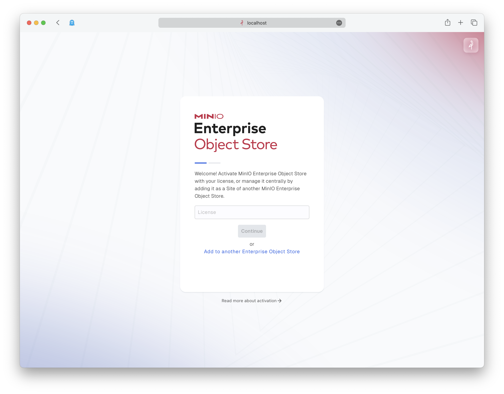
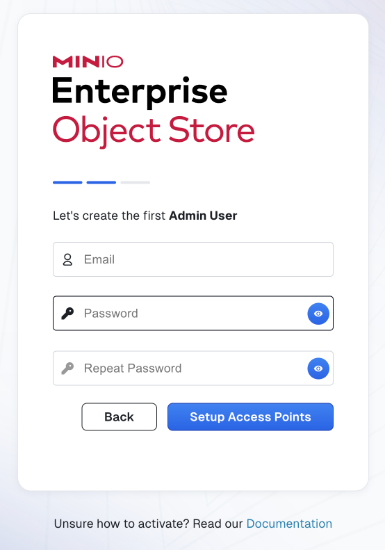

# MinIO Enterprise Object Store

A unified management interface for all the MinIO Enterprise Store features:

- Observability
- Key Management
- Load Balancer
- Firewall
- Cache
- Operator

MinIO Enterprise Object Store runs in a Kubernetes cluster.

## Pre-requisites

* An active Kubernetes environment running a [maintained version](https://kubernetes.io/releases/)
* [`kubectl` CLI tool](https://kubernetes.io/docs/tasks/tools/#kubectl)

### Environment

You can run MinIO Enterprise Object Store on Kubernetes providers such as

- Redhat Openshift
- Google Kubernetes Engine
- Amazon Elastic Kubernetes Service
- Azure Kubernetes Service
- Upstream Kubernetes

Other Kubernetes providers may also work.

## Getting Started

1. Install MinIO Enterprise Object Store with the following `kubectl` command

   ```shell
   kubectl apply -k dl.min.io/eos
   ```

2. Use `kubectl proxy` to port forward the Enterprise Console to access the User Interface

   ```shell
   kubectl -n eos port-forward svc/eos-controller 8444:8444
   ```

3. In your browser, go to http://localhost:8444

4. The MinIO Enterprise Object Store Setup screen prompts for the license.

   

   To obtain your license, see the [SUBNET cluster registration page](https://subnet.min.io/cluster/register).

5. Create the initial Admin User, then select **Setup Access Points** and click `Finish Setup`.

   

   Provide the **email address** and **password** for the user.
   Enter the **password** twice.


