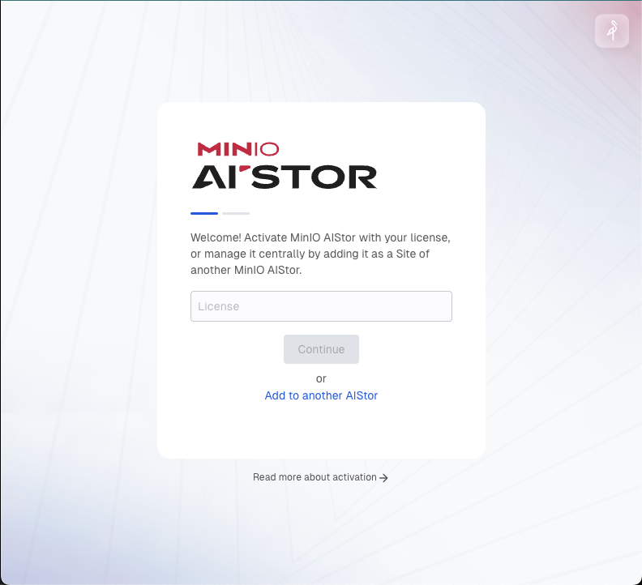
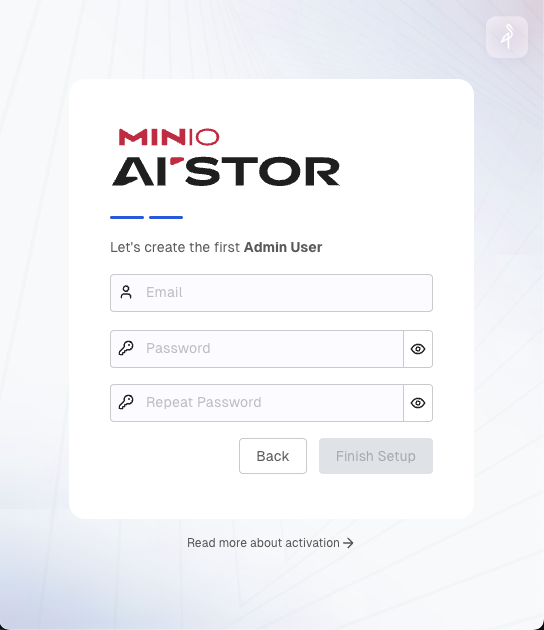
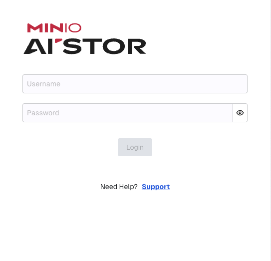
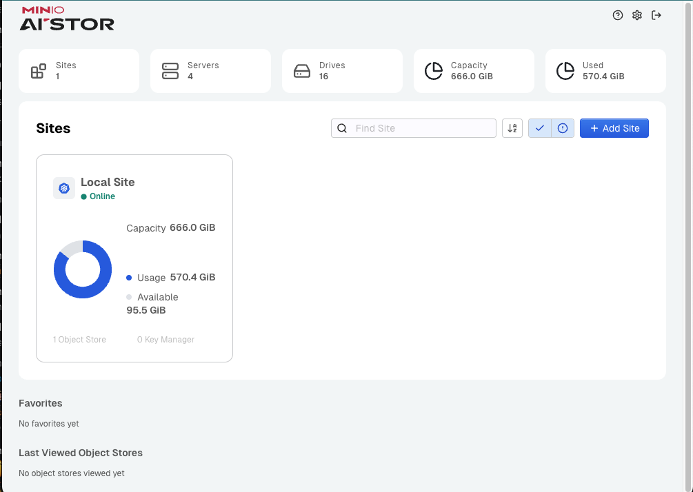

# AIStor

Hyperscale Object Store for AI

MinIO AIStor is designed to allow enterprises to consolidate all of
their data on a single, private cloud namespace. Architected using
the same principles as the hyperscalers, AIStor delivers performance
at scale at a fraction of the cost compared to the public cloud.

AIStor runs in Kubernetes.

## Pre-requisites

* An active Kubernetes environment running a [maintained version](https://kubernetes.io/releases/)
* [`kubectl` CLI tool](https://kubernetes.io/docs/tasks/tools/#kubectl)

### Environment

You can run AIStor on Kubernetes providers such as

- Redhat Openshift
- Google Kubernetes Engine
- Amazon Elastic Kubernetes Service
- Azure Kubernetes Service
- Upstream Kubernetes

Other Kubernetes providers may also work.

## Getting Started

1. Install AIStor with the following `kubectl` command

   ```shell
   kubectl apply -k https://min.io/k8s/aistor
   ```
   
or install with helm
   ```shell
   helm repo add aistor https://aistor.min.io/
   helm install --namespace aistor --create-namespace aistor aistor/aistor
   ```

2. Use `kubectl proxy` to port forward the AIStor Console to access the User Interface

   ```shell
   kubectl -n aistor port-forward svc/aistor 8444:8444
   ```

3. In your browser, go to http://localhost:8444

4. AIStor Setup screen prompts for the license.

   

   To obtain your license, see the [SUBNET cluster registration page](https://subnet.min.io/cluster/register).

5. Create the initial Admin User and click `Finish Setup`.

   

   Provide the **email address** and **password** for the user.
   Enter the **password** twice.

6. Login with the created credentials.

   


7. Welcome to the AIstor dashboard!

   